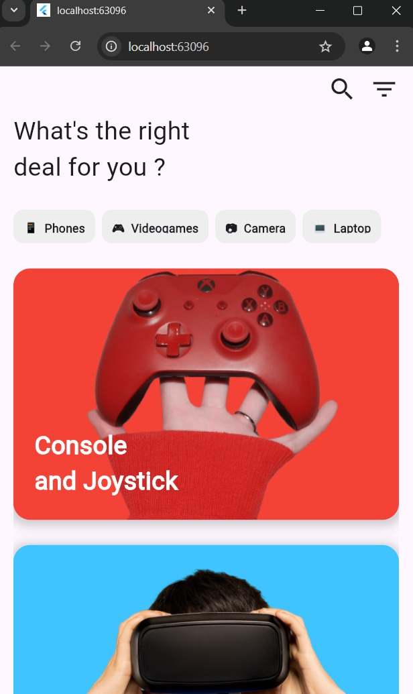
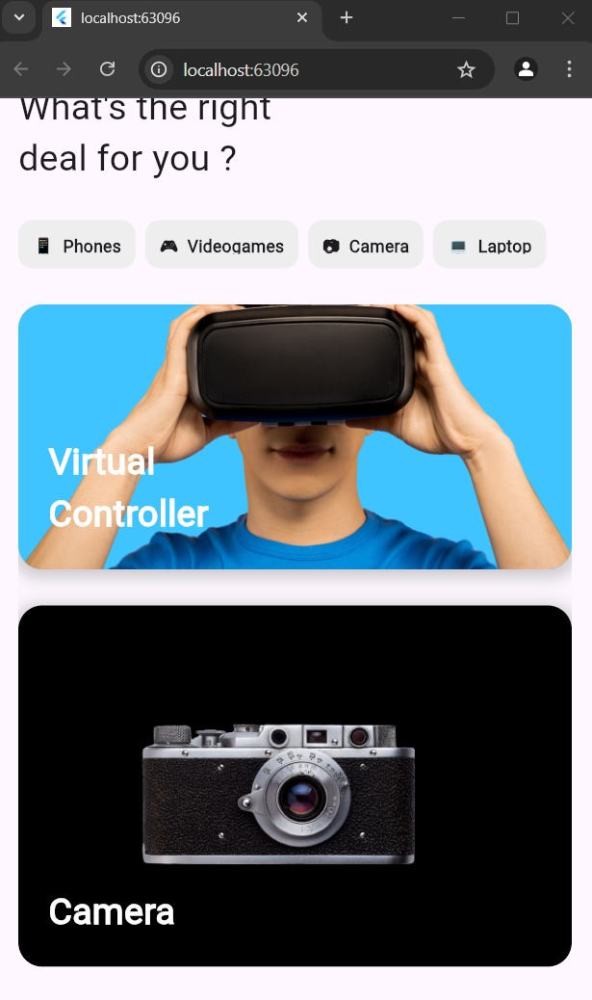
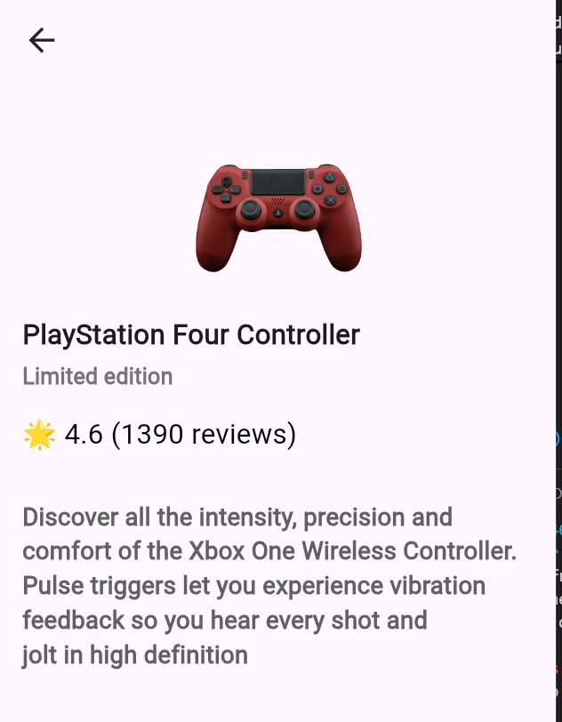
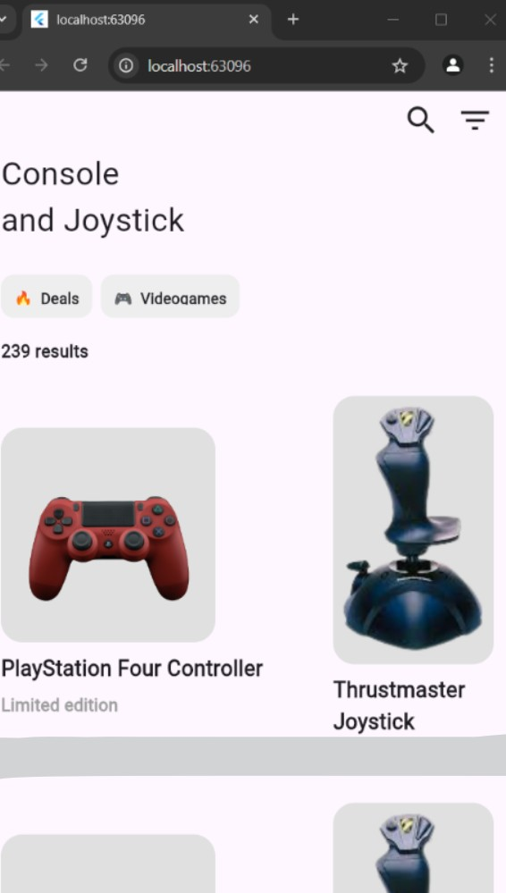

A Gaming e-commerce site built using flutter.

# GamingGear - eCommerce App (Flutter)

## Table of Contents

- [Overview](#overview)
- [Features](#features)
- [Installation](#installation)
- [Screenshots](#screenshots)
- [Technologies Used](#technologies-used)
- [Contributing](#contributing)

## Overview

**GamingGear** is a modern eCommerce application built using **Flutter** for selling gaming products like gaming laptops, keyboards, mice, monitors, and accessories. The app features a clean UI, product categories, cart management, and a seamless checkout process.

## Features

- 🔹 **User Authentication** (Sign up, Login, Logout)
- 🔹 **Product Listings** with images, descriptions, and price details
- 🔹 **Categories** for easy product browsing
- 🔹 **Search Functionality** to quickly find products


## Installation

Clone the repository:

```bash
    git clone https://github.com/AniketGaurav01/E-commerce-Flutter-App.git
```

Navigate to the project directory:

```bash
    cd game_store_ui
```

Install dependencies:

```bash
    flutter pub get
```

Run the application:

```bash
    flutter run
```

Build APK for release:

```bash
    flutter build apk
```

## Screenshots







## Contributing

Feel free to contribute by **forking the repository**, making changes, and submitting a **pull request**. 🚀

---

### 🔗 [GitHub Repository](https://github.com/AniketGaurav01/E-commerce-Flutter-App)

For any issues, please create an **issue** in the repository or contact the developers.

---

Happy Coding! 🎮🔥

